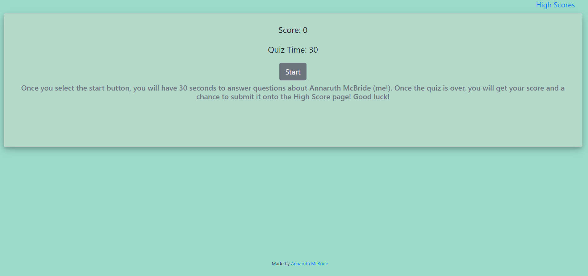

# quiz
A simple quiz. For every correct answer time is added, for every wrong answer you lose time.

# Contributors

- armcbride

# Technologies
    
  -  HTML
  -  CSS
  -  javaScript
  -   

# Live Link
- Quiz About Me: <a href ="https://armcbride.github.io/about-me-quiz/develop/index.html" target="_blank">https://armcbride.github.io/about-me-quiz/develop/index.html </a>
- Portfolio: <a href = "https://armcbride.github.io" target = "_blank">https://armcbride.github.io</a>
- Repository: <a href = "https://github.com/armcbride/about-me-quiz" target = "_blank">https://github.com/armcbride/about-me-quiz </a>

# Contact me

- <a href="mailto:armcbride17@gmail.com">Email: armcbride17@gmail.com</a>  

# View

